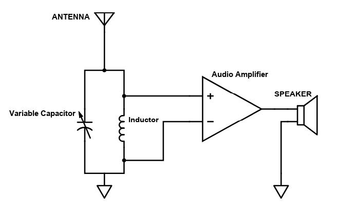

# AM Radio
A primitive, yet functional, budget AM radio.

**_SUTD 2019 10.005 Physics II 1D Project (19F07 Group 11)_**

We were instructed to build a hand-made AM radio receiver setup with a budget of SGD$0. Cheap/free materials were acquired and scavenged around SUTD from friends and bins, respectively.

## Overall Circuit

## Final Prototype

Note: The coaxial cylindrical variable capacitor was crafted and used as backup, in case the rotary variable capacitor failed.

## Repository Details

I have included our [project report](./Cohort07Group11.pdf), our customised [bill of materials](./AMRadio-BOM.xlsx) and several CAD files that we have designed and utilised (or not) over the course of the project.

Our project report contains the details of the working principles of the components, as well as the various design considerations and choices (and some pictures!).

## Acknowledgement

I would like to thank my teammates for bearing with my idea of the rotary variable capacitor, even if a lot of work had to be put into it. I would also like to thank a few of my other classmates who assisted me with ideation, CAD-ing and lending me their tools and materials (such as a 3D printer, a gluestick and the acrylic).